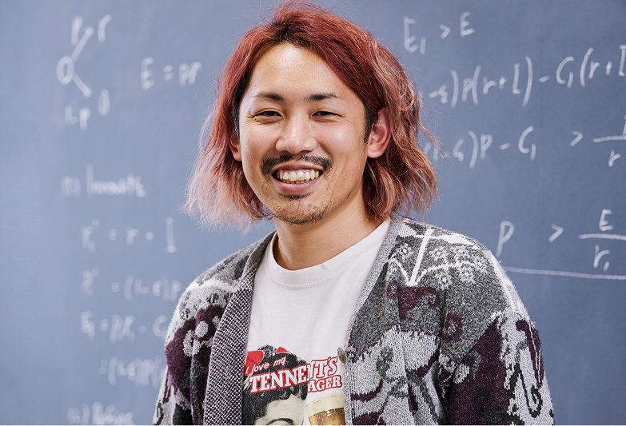
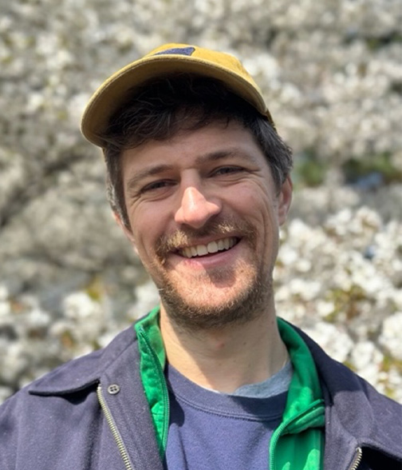
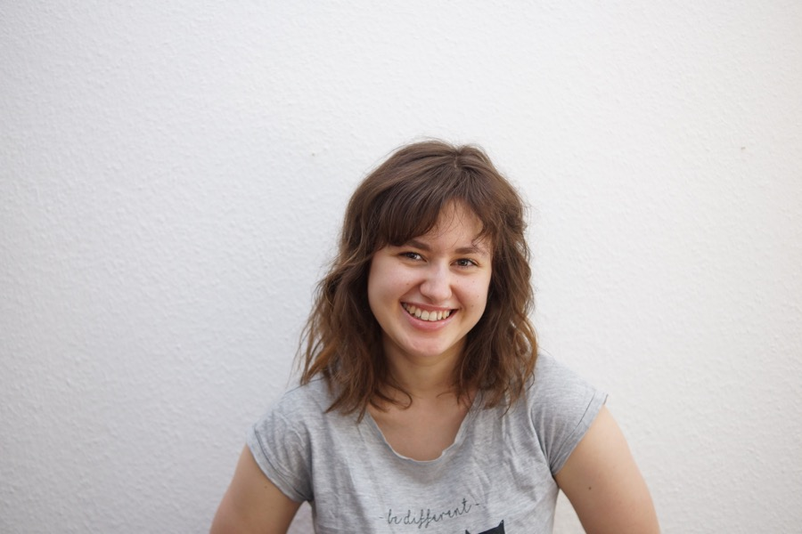
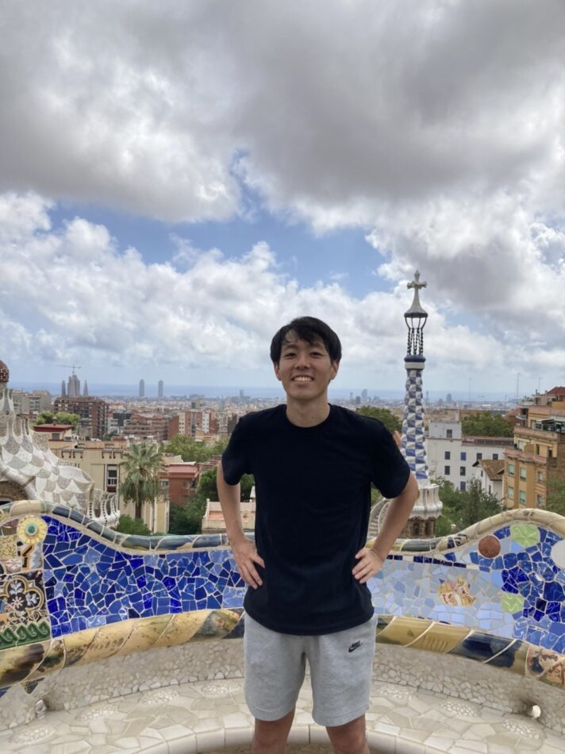
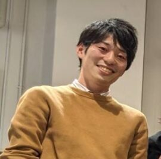

## Welcome! ようこそ！ {.center}

**Linked hands-on notebook（演習用ノートブック）:**<br>
`tutorials/02_simulating_randomness_notebook.Rmd`

**You + us, three teaching days, one goal:**

build a tiny society inside a computer —
and present what it teaches us about *real* people

::: {.fragment}
We will work in English. We will help each other.
:::

## Who we are {.smaller}

**Computational Group Dynamics (COGNAC) Collaboration Unit**
RIKEN Center for Brain Science

We study how *groups* of humans and
animals learn and decide together.

::::: {.columns}
::: {.column width="33.3%"}
{height=95}

**Wataru Toyokawa**
:::
::: {.column width="33.3%"}
{height=95}

**Henri Vandendriessche**
:::
::: {.column width="33.3%"}
{height=95}

**Alexandra Witt**
:::
:::::

::::: {.columns}
::: {.column width="50%"}
{height=95}

**Ryutaro Mori**
:::
::: {.column width="50%"}
{height=95}

**Seiya Nakata**
:::
:::::

## Groups do amazing things

- A school of fish turns as one — **no leader**
- Ants find the shortest path to food — **no map**
- A crowd guesses the weight of an ox better than any expert
- A silly dance spreads to 100 million people in a week

::: {.fragment}
**Nobody is in charge. So who decides?**
:::

## The puzzle of collective behaviour（集団行動）

Individual rules → group patterns

| Individual does... | The group shows... |
|---|---|
| follow your neighbour | flocking, waves |
| join the longer queue | traffic jams, viral trends |
| copy the majority | fashion, price booms, culture |

The group behaviour is not written anywhere —
it **emerges**（創発する）.

## How can we study this?

Watching groups is not enough — we need to know **why**.

::: {.incremental}
- Can't interview a fish 🐟
- Can't rewind a stock market crash ⏪
- Can't ask 1000 people to repeat their lives 100 times
:::

::: {.fragment}
**Solution: build the society ourselves — in a computer.**
:::

## What is a model?

A map of Tokyo is not Tokyo.

It is *useful because* it leaves things out.

::: {.fragment}
A **model** = a deliberately simplified world
keeping only what we care about

A **simulation** = pressing **play** on a model
:::

## Our route through the camp

| When | What we will do |
|---|---|
| **Before camp** | meet R in Tutorial 1 |
| **Day 1** | arrive, meet the team, and get oriented |
| **Day 2 morning** | build toy worlds in Tutorial 2 |
| **Day 2 afternoon** | build a learning agent in Tutorial 3 |
| **Day 3 morning** | add social learning in Tutorials 4–5 |
| **Day 3 afternoon** | investigate your own group question |
| **Day 4** | finish, rehearse, and present like scientists |

## Draft timetable: Day 2 {.smaller}

**Tuesday, 28 July — Models and learning agents**

| Time | Activity | Facilitator |
|---|---|---|
| **10:00–10:30** | Say hello and get set up<br>Check that R and RStudio work (Tutorial 1 if needed) | Teaching team |
| **10:30–12:00** | Tutorial 2: Simulating randomness | Wataru |
| **12:00–13:00** | Lunch | |
| **13:00–14:30** | Tutorial 3: Reinforcement-learning agents | Henri *(to confirm)* |
| **14:30–16:00** | Hands-on work and discussion | Teaching team *(to confirm)* |


::: {.fragment}
This is our current plan. We may adjust it together.
:::

## Draft timetable: Day 3 {.smaller}

**Wednesday, 29 July — Social learning and group projects**

| Time | Activity | Facilitator |
|---|---|---|
| **10:00–11:30** | Tutorials 4–5: Social learning | Alex & Ryutaro *(to confirm)* |
| **11:30–12:00** | Discuss and choose a group project | Teaching team |
| **12:00–13:00** | Lunch | |
| **Afternoon** | Work on group projects | Teaching team |
| **17:30–19:00** | Reception | All |

::: {.fragment}
You will turn a question into a small simulation study.
:::

## Draft timetable: Day 4 {.smaller}

**Thursday, 30 July — Complete and share the project**

| Time | Activity |
|---|---|
| **Before 15:00** | Finish the analysis, prepare the presentation, and rehearse<br>*(exact schedule to confirm)* |
| **15:00** | Group presentation |

::: {.fragment}
The Day 4 preparation schedule is still open for discussion.
:::

## Our lab language: R

- Free software used by scientists everywhere
- You type commands, R answers, draws, simulates
- Tutorial 1 gave you the basics; today we use them to do science

```{r}
#| echo: true
sample(1:6, size = 10, replace = TRUE)   # R rolls 10 dice
```

::: {.fragment}
Every simulation this week is built from
little pieces of randomness like this.
:::

## Tutorial 2: three tools

You will build:

1. **Repeated experiments** — flip thousands of virtual coins
2. **A function** — give a useful set of commands a name
3. **A random walk** — make a path from uncertain steps

::: {.fragment}
The goal is not to memorise code.

The goal is to ask: **what pattern appears when simple rules repeat?**
:::

## Rules of the camp lab

1. **Type it yourself** — copy-paste teaches nothing
2. **Predict before you run** — then be surprised
3. **Errors are normal** — red text happens to professionals daily
4. **Ask anything** — asking is what researchers do all day

## Hands-on: Tutorial 2 {.center}

Open:

`tutorials/02_simulating_randomness_notebook.Rmd`

Work from top to bottom. **Predict before you run.**

Need an R refresher? Ask us, or check
`tutorials/01_welcome_to_r_notebook.Rmd`.
