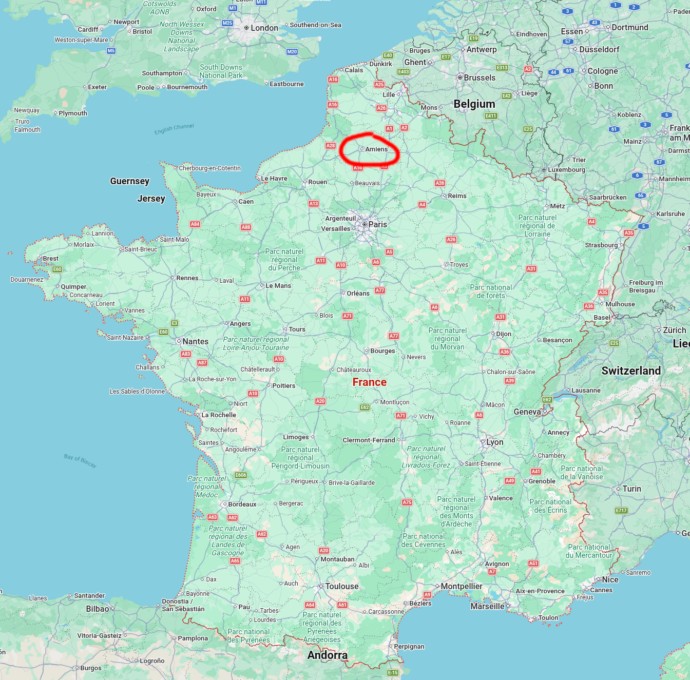
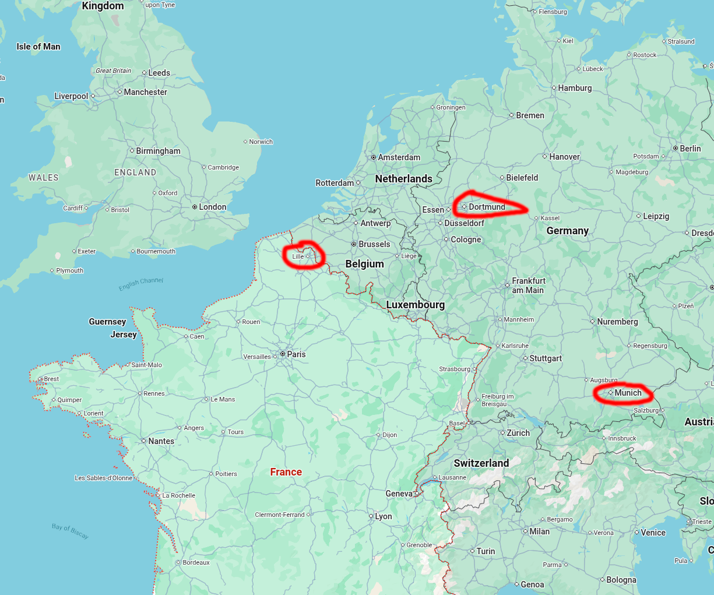
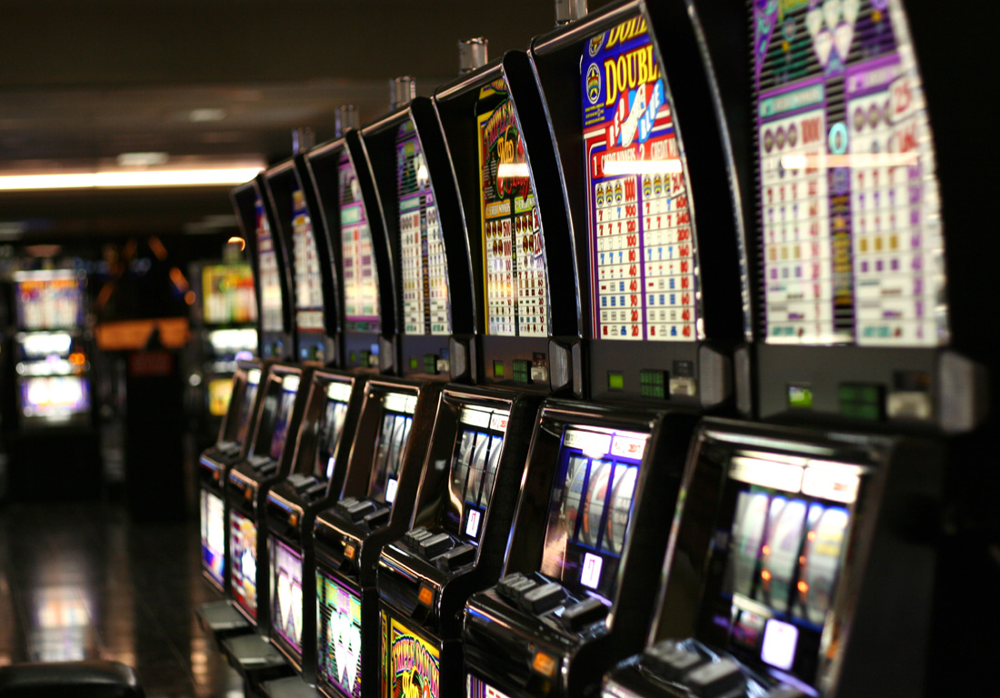
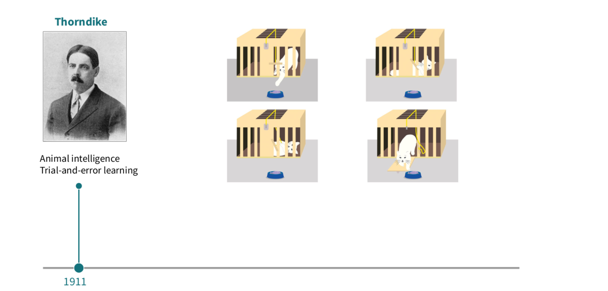
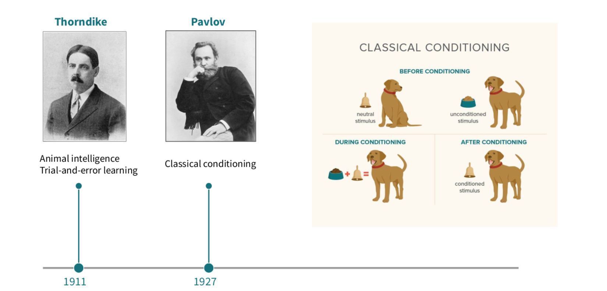
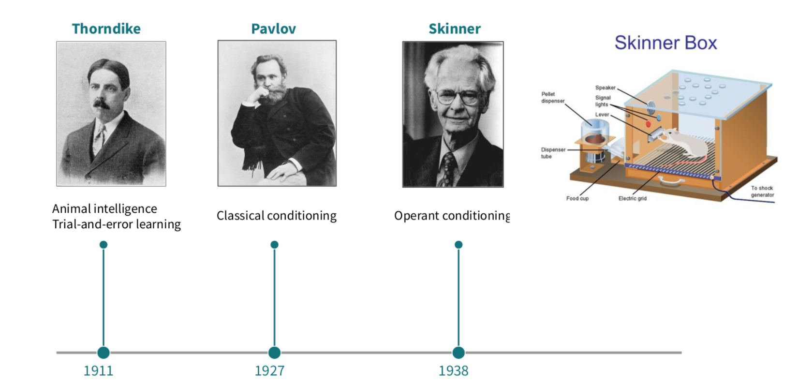
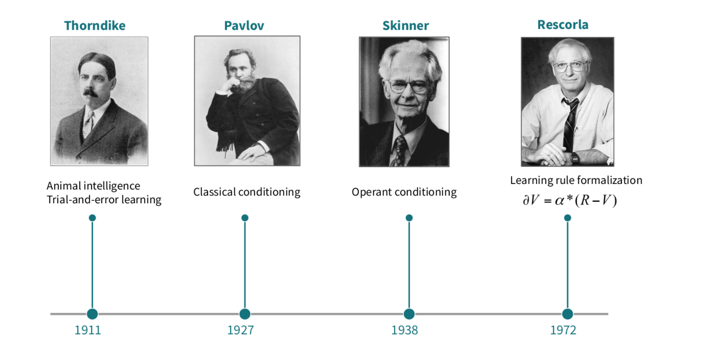

## About me

Hello, my name is Henri Vandendriessche!

I was born in France.

{fig-align="left"}

## Where I studied

I studied electronics and computer science in France and Germany

{fig-align="left"}

## What I have been doing after my Master

- I worked as an engineer for seven years at the Ecole Normale Supérieure in Paris in the Cognitive Science Department 
- In 2021, I started my PhD in the Human Reinforcement Learning Team at the Laboratoire de Neurosciences Cognitives et Computationnelles (LNC2) in the same institution.
- in 2025, After finishing my PhD I came to Japan in 2025


## Outside of work

What do I like?

- Football
- Reading books and comics/BD/manga
- Playing video games
- Spending time with my friends
- Back in France I was in a music band and I was visiting people in prison every week.

## How to represent an agent that learns? {.center}

The most famous example is called the multi-armed bandit.
The name comes from imagining a gambler in a Las Vegas Casino that wants to play slot machines.

But which one?



## The slot machine problem {.center}

**Linked hands-on notebook（演習用ノートブック）:**<br>
`tutorials/03_learning_agents_notebook.Rmd`

The simplest case is with only two machines. One pays 30% of the time, one pays 70% of the time.

**You don't know which is which. 100 turns.**

What do you do?

## Trial and error

You have to try the machines to see by yourself which machine is the good one

- You try one and either you win (you get a reward) or you lose (you receive a punishment).

::: {.incremental}
- But one try is not enough, to have a reliable representation you need more information.
- How many time do you need to sample each machine to be sure?
:::

## You face this problem every day

- New restaurant, or your favorite one?
- New song, or your playlist?
- New study method, or the usual one?

::: {.fragment}
**Explore / exploit**（探索・活用）?

This is the *multi-armed bandit problem* —
studied in psychology, neuroscience, economics, and AI.
:::


## Psychology: brief history I

**Edward Thorndike: Connectionism**

His work is focused on whether animals could learn tasks through imitation or observation




## Psychology: brief history II

**Ivan Pavlov: Classical conditioning**

Pavlov Showed the relationship between environmental stimuli and behavioral responses.




## Psychology: brief history III

**Burrhus F. Skinner: Operant conditioning**

Voluntary behaviors in animals can be reinforced with reward and decreased (even extinct) with punishment. 



## Psychology: brief history VI

**Robert A. Rescorla: Learning rule**

He conceptualized with Allan R. Wagner the first mathematical formalization of the conditioning phenomenon. 



## How to 

## Let's build a mind (a small one)

Our agent needs only two abilities:

1. **Remember** how good each option seems → a value $Q$ per option
2. **Update** that memory after every experience

$$Q_{\text{new}} = Q_{\text{old}} + \alpha \, (\text{reward} - Q_{\text{old}})$$

::: {.fragment}
$(\text{reward} - Q)$ = **prediction error** = "how surprised am I?"

$\alpha$ (alpha) = **learning rate** = how much the newest experience counts
:::

## Fun fact: your brain does this

Dopamine neurons（ドーパミン神経細胞）fire in proportion to
**prediction error** — not to reward itself.

Surprising win → big signal.
Expected win → almost nothing.

::: {.fragment}
This simple equation helped neuroscientists
*decode what dopamine means*.
Simple models can be powerful.
:::

## From values to choices: softmax

Always pick the best-looking option? Then you never fix wrong assumptions.

**Softmax rule:** mostly pick the best, sometimes explore.

- $\beta$ (beta) small → curious, random
- $\beta$ (beta) big → greedy, confident

::: {.fragment}
Two numbers, $\alpha$ and $\beta$ = the agent's **personality**
:::

## The whole agent

```r
for (t in 1:100) {
  p      <- softmax(Q, beta)              # how attractive is each option?
  choice <- sample.int(n_options, size = 1, prob = p) # pick one
  reward <- rbinom(1, 1, reward_probs[choice])        # world responds
  Q[choice] <- Q[choice] +
               alpha * (reward - Q[choice])  # learn from surprise
}
```

**A learning mind in ~6 lines.**

## What 1000 agents look like

```{r}
#| fig-height: 4.5
source("R/bandit_functions.R")
library(ggplot2)
set.seed(1)
many <- do.call(rbind, lapply(1:1000, function(i) simulate_learner()))
curve <- aggregate(chose_best ~ trial,
                   data = transform(many, chose_best = as.numeric(choice == 2)),
                   FUN = mean)
ggplot(curve, aes(trial, chose_best)) +
  geom_line(linewidth = 1.2, color = "steelblue") +
  geom_hline(yintercept = 0.5, linetype = "dashed") +
  ylim(0, 1) +
  labs(x = "trial", y = "fraction choosing better option") +
  theme_minimal(base_size = 18)
```

The same curve appears in humans, monkeys, pigeons, bees...

## Hands-on: Tutorial 3 {.center}

Open:

`tutorials/03_learning_agents_notebook.Rmd`

Build the learning agent yourself.

Then experiment:

- a very slow learner ($\alpha = 0.05$)?
- a goldfish-memory learner ($\alpha = 1$)?
- a completely random agent ($\beta = 0$)?
- a *hard* world (45% vs 55%)?

**Predict first. Then run.**

## Play the slot-machine game {.center}

In the RStudio **Console**, run:

```r
source("R/play_bandit_game.R")
play_game("YourName")
```

Play in solo mode: do not add `hints = TRUE` yet.

Every player must use a different name. Using the same name will overwrite
the earlier file.

<!-- Resume this deck after Tutorial 3 and the solo slot-machine game. -->

## Day 2 wrap-up {.center}

Today you built two levels of a model:

::: {.incremental}
1. a **world** made from probability
2. an **agent** that learns from experience
:::

::: {.fragment}
Tomorrow we add the missing part: **other agents**.
:::

## Tomorrow's question

An agent learns **alone** today.

Tomorrow, agents start **watching each other**.

When does copying make a group smarter?

When does it create herding（群れ行動・付和雷同）?

## Preview your group project

Tomorrow afternoon, your group will choose one question.

Examples:

- What is the best amount of copying?
- Are bigger groups wiser?
- When is conformity useful?
- Do four real humans behave like our model?

## Before you leave {.center}

Open:

`project/mini_project_menu.md`

Choose **one question that interests you**.

You do not need to decide today. Come back tomorrow with one idea.
