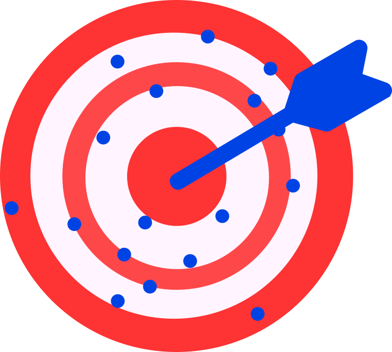
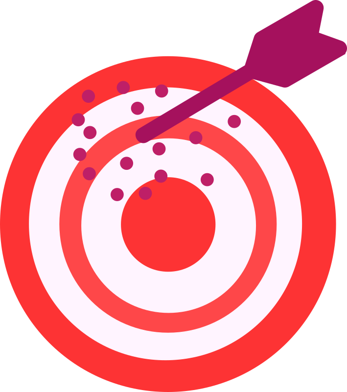

## From learners to crowds {.center}

You now have agents that can copy.

What happens to the **whole group**?

## 1906: the ox and the crowd

At a fair, about 800 people guessed the weight of an ox.

Nearly everyone was wrong...

::: {.fragment}
...but the **average of all guesses** was off by **less than 1%**.
```{r}
#| fig-width: 7
#| fig-height: 3.5
#| out-width: "75%"
#| fig-align: center

library(ggplot2)
set.seed(1906)

truth <- 500
guesses <- rnorm(800, mean = truth, sd = 200)  # 800 noisy guesses

ggplot(data.frame(guesses), aes(guesses)) +
  geom_histogram(bins = 800, fill = "steelblue") +
  geom_vline(xintercept = truth, color = "red", linewidth = .5) +
  geom_vline(xintercept = mean(guesses), color = "gold2", linewidth = .5) +
  labs(title = "800 noisy guesses (red = truth, yellow = crowd average)")+
  theme_classic()
```

:::

## 1906: the ox and the crowd

**Wisdom of crowds**: independent errors point in different
directions and *cancel out*.

{fig-align="center" width=25% height=25%}

## Copying makes a group smarter...

```{r}
#| fig-height: 4.5
source("R/bandit_functions.R")
library(ggplot2)
set.seed(7)
mix <- do.call(rbind, lapply(c(0, 0.7), function(s) {
  perf <- average_performance(n_reps = 25, n_agents = 10, n_trials = 100,
                              reward_probs = c(0.3, 0.5),
                              alpha = 0.3, beta = 5,
                              sigma = s, theta = 2)
  transform(perf, society = ifelse(s == 0, "no copying (sigma=0)","copying (sigma=0.7)"))
}))
mix$society = factor(mix$society, levels = c("no copying (sigma=0)","copying (sigma=0.7)"))
ggplot(mix, aes(trial, correct, color = society)) +
  geom_line(linewidth = 1.2) + ylim(0, 1) +
  labs(y = "fraction choosing better option") +
  theme_minimal(base_size = 18) + theme(legend.position = "bottom")
```

Good discoveries spread; individual mistakes get filtered out.

## What if the world changes? {.center}

The best option secretly swaps halfway through.

Which learners will adapt faster?

Write down your prediction before you see the result.

## Hands-on 2: Tutorial 5 {.center}

Open:

`tutorials/05_collective_behaviour_notebook.Rmd`

Find collective wisdom. Then change the world and look for herding.

**Predict first. Then run.**

<!-- Resume this deck after Tutorial 5. -->

## Copying makes a group smarter...

```{r}
#| fig-height: 4.5
source("R/bandit_functions.R")
library(ggplot2)
set.seed(7)
mix <- do.call(rbind, lapply(c(0, 0.7), function(s) {
  perf <- average_performance(n_reps = 25, n_agents = 10, n_trials = 100,
                              reward_probs = c(0.3, 0.5),
                              alpha = 0.3, beta = 5,
                              sigma = s, theta = 2)
  transform(perf, society = ifelse(s == 0, 'individual learners','social learners (sigma=0.7)'))
}))
mix$society = factor(mix$society, levels = c('individual learners','social learners (sigma=0.7)'))
ggplot(mix, aes(trial, correct, color = society)) +
  geom_line(linewidth = 1.2) + ylim(0, 1) +
  labs(y = "fraction choosing\n(currently) best option") +
  theme_minimal(base_size = 18) + theme(legend.position = "bottom")
```

## ...until the world changes

```{r}
#| fig-height: 4.5
set.seed(11)
sweep <- do.call(rbind, lapply(c(0, 0.7), function(s) {
  perf <- average_performance(n_reps = 25, n_agents = 10, n_trials = 150,
                              reward_probs = c(0.5, 0.7),
                              alpha = 0.7, beta = 5,
                              sigma = s, theta = 4, change_point = 76)
  transform(perf, society = ifelse(s == 0, "individual learners","social learners (sigma=0.7)"))
}))
sweep$society = factor(sweep$society, levels = c('individual learners','social learners (sigma=0.7)'))
ggplot(sweep, aes(trial, correct, color = society)) +
  geom_line(linewidth = 1.2) +
  geom_vline(xintercept = 75.5, linetype = "dashed") +
  ylim(0, 1) +
  labs(y = "fraction choosing\n(currently) best option",
       caption = "dashed line: the best option secretly swaps") +
  theme_minimal(base_size = 18) + theme(legend.position = "bottom")
```

## Herding（群れ行動・付和雷同）{style="font-size: 0.9em;"}

After the change, heavy copiers keep choosing the **old** best option.

Everyone copies everyone; the majority keeps making itself bigger.

::: {.incremental}
- fast-changing fashion trends 👟
- stock market crashes 📉
- misinformation cascades 📱
:::

::: {.fragment}
<div style="text-align: center;">

{width="7.5%"}

**Same strategy. Different environment. Opposite result.**

</div>
:::


## This is real science, done here

Real people played this game in groups, online
(Toyokawa, Whalen & Laland 2019, *Nature Human Behaviour*):

- moderate copying → collective intelligence ✅
- strong conformity + changing world → herding ❌

::: {.fragment}
Today, **you** run this research program —
with your own questions.
:::

## Your group project

1. **Play the game yourselves** — `R/play_bandit_game.R`
   (solo, then with social hints). You are the data! 📊
2. **Pick a question** from `project/mini_project_menu.md`
   (or invent your own)
3. **Simulate, plot, interpret**
4. **Export your figures before 15:45**
5. **Start your slides before leaving the lab**

## A good 10-minute talk

1. The question — *why is it interesting?* (2 min)
2. The model — *the rules of your toy world* (2 min)
3. Your prediction — *what did you expect?* (1 min)
4. What you did (1 min)
5. Results — *1–2 clear figures* (2 min)
6. What it means + what you'd do next (2 min)

## Time to get started!
Template ready for you: `slides/final_presentation_template.qmd`

Project menu: `project/mini_project_menu.md`

**Choose your question. Predict. Then start! 🚀**
